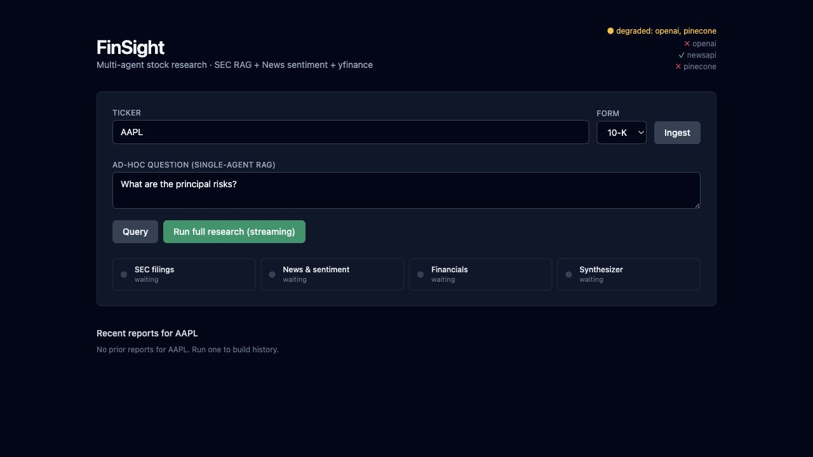

# FinSight

[](https://www.python.org/)
[](https://fastapi.tiangolo.com/)
[](https://langchain-ai.github.io/langgraph/)
[](https://react.dev/)
[](backend/app/tests)
[](LICENSE)

FinSight is a full-stack, multi-agent equity research app. Enter a ticker and
it builds a structured research report from SEC filing retrieval, recent news
sentiment, and live financial metrics.

> This project is for software demonstration and research workflow exploration.
> It is not financial advice.



## What It Does

- Ingests the latest SEC `10-K` or `10-Q` filing for a ticker.
- Chunks and embeds filing text into Pinecone for per-ticker retrieval.
- Runs a LangGraph research pipeline with specialist agents for:
  - SEC filing RAG
  - recent news sentiment
  - financial metrics from yfinance
- Streams agent progress to the browser over Server-Sent Events.
- Synthesizes a final `Buy`, `Hold`, `Sell`, or `Pending` report with concrete
  justification.
- Persists completed research runs to SQLite for history and comparison.
- Tracks OpenAI token usage and estimated cost per research request.

## Architecture

```text
React + TypeScript SPA
  live progress, filing ingest, ad-hoc RAG query, report history
        |
        | REST + Server-Sent Events
        v
FastAPI backend
  request IDs, optional API-key auth, rate limiting, CORS, JSON logs
        |
        v
LangGraph StateGraph
  START
    |--------------------|----------------------|
    v                    v                      v
  SEC agent           News agent             Metrics agent
  Pinecone RAG        NewsAPI + VADER        yfinance TTM metrics
    |--------------------|----------------------|
                         v
                   Synthesizer
                   OpenAI JSON report
                         |
                         v
                   SQLite research_runs
```

The backend is designed to degrade cleanly. Missing NewsAPI credentials skip the
news agent; missing filing vectors skip the SEC agent; upstream failures return
typed `error` payloads instead of crashing the whole graph.

## Tech Stack

| Layer | Tools |
| --- | --- |
| Frontend | React 18, TypeScript, Vite, Tailwind CSS |
| API | FastAPI, Uvicorn, Gunicorn, SlowAPI, SSE Starlette |
| Agent orchestration | LangGraph `StateGraph` |
| LLM and embeddings | OpenAI chat completions and embeddings |
| Retrieval | Pinecone serverless index, namespace per ticker |
| Market/news data | SEC EDGAR, NewsAPI, VADER, yfinance |
| Persistence | SQLAlchemy async ORM, SQLite by default |
| Ops | Docker, Docker Compose, nginx SPA proxy, structured JSON logs |
| Tests | pytest, pytest-asyncio, pytest-httpx, ruff, TypeScript build |

## Repository Layout

```text
finsight/
├── backend/
│   ├── app/
│   │   ├── agents/              # LangGraph state and agent nodes
│   │   ├── observability/       # JSON logs and OpenAI cost tracking
│   │   ├── persistence/         # async SQLAlchemy history store
│   │   ├── routers/             # health, filings, research endpoints
│   │   ├── schemas/             # Pydantic API models
│   │   ├── services/            # SEC, Pinecone, OpenAI, NewsAPI, yfinance
│   │   └── tests/               # mocked backend test suite
│   ├── Dockerfile
│   ├── Dockerfile.dev
│   └── requirements.txt
├── frontend/
│   ├── src/
│   │   ├── api/client.ts        # typed REST and SSE client
│   │   ├── components/          # input, progress, report, history panels
│   │   └── App.tsx
│   ├── Dockerfile
│   ├── Dockerfile.dev
│   └── nginx.conf
├── docs/assets/
│   └── finsight-dashboard.jpg
├── docker-compose.yml
├── docker-compose.dev.yml
├── .env.example
└── Makefile
```

## Quickstart

### 1. Configure Environment

```bash
cp .env.example .env
```

Fill in at least:

```bash
OPENAI_API_KEY=...
PINECONE_API_KEY=...
SEC_USER_AGENT="FinSight Research your.email@example.com"
```

Optional:

```bash
NEWS_API_KEY=...
FINSIGHT_API_KEY=...
```

`FINSIGHT_API_KEY` enables a simple `X-API-Key` gate on non-health routes. Leave
it empty for local development.

### 2. Run With Docker

```bash
docker compose up --build
```

- Frontend: http://localhost:8080
- Backend: http://localhost:8000
- API docs: http://localhost:8000/docs

### 3. Run With Hot Reload

```bash
docker compose -f docker-compose.yml -f docker-compose.dev.yml up --build
```

- Frontend with Vite HMR: http://localhost:5173
- Backend API: http://localhost:8000

## API Overview

| Method | Path | Purpose |
| --- | --- | --- |
| `GET` | `/health` | Liveness probe |
| `GET` | `/health/ready` | Dependency readiness for OpenAI, Pinecone, and NewsAPI |
| `POST` | `/filings/ingest` | Fetch SEC filing, chunk, embed, and upsert to Pinecone |
| `POST` | `/filings/query` | Query previously ingested filing chunks |
| `POST` | `/research/{ticker}` | Run the full research graph and persist the result |
| `GET` | `/research/{ticker}/stream` | Stream agent progress and final result via SSE |
| `GET` | `/research/history/{ticker}` | Return recent persisted research runs |

Example:

```bash
curl -X POST http://localhost:8000/filings/ingest \
  -H "Content-Type: application/json" \
  -d '{"ticker":"AAPL","form":"10-K"}'

curl -N http://localhost:8000/research/AAPL/stream
```

## Configuration

| Variable | Required | Description |
| --- | --- | --- |
| `OPENAI_API_KEY` | Yes | Chat completion and embedding calls |
| `PINECONE_API_KEY` | Yes | Filing vector store |
| `PINECONE_INDEX_NAME` | No | Defaults to `finsight-filings` |
| `PINECONE_CLOUD` | No | Defaults to `aws` |
| `PINECONE_REGION` | No | Defaults to `us-east-1` |
| `SEC_USER_AGENT` | Yes | SEC EDGAR requires an app/contact user agent |
| `NEWS_API_KEY` | No | Enables the news agent; missing key skips news |
| `NEWS_LOOKBACK_DAYS` | No | Defaults to `30` |
| `NEWS_MAX_ARTICLES` | No | Defaults to `30` |
| `EMBEDDING_MODEL` | No | Defaults to `text-embedding-3-small` |
| `LLM_MODEL` | No | Defaults to `gpt-4o-mini` |
| `FINSIGHT_API_KEY` | No | Optional API-key protection |
| `RATE_LIMIT_RESEARCH` | No | Defaults to `30/minute` |
| `RATE_LIMIT_FILINGS` | No | Defaults to `60/minute` |
| `DATABASE_URL` | No | Defaults to local SQLite at `./data/finsight.db` |
| `CORS_ORIGINS` | No | Comma-separated allowed origins |

## Local Development

Backend:

```bash
cd backend
python -m venv .venv
source .venv/bin/activate
pip install -r requirements.txt
uvicorn app.main:app --reload
```

Frontend:

```bash
cd frontend
npm install
npm run dev
```

Useful Make targets:

```bash
make backend-test
make frontend-install
make pinecone-init
make fetch-sample TICKER=AAPL
```

## Tests And Checks

```bash
cd backend
python -m ruff check app
python -m pytest -q

cd ../frontend
npm run lint
npm run build
```

Current local verification:

- Backend ruff: passing
- Backend pytest: `52 passed`
- Frontend TypeScript/build: passing

## Security And Publish Notes

The repository is intended to be safe to publish with only placeholder
configuration committed.

- Real credentials belong in `.env`, which is ignored by git.
- `.env.example` contains empty placeholders only.
- Docker build contexts ignore `.env`, local virtualenvs, logs, caches, and build
  outputs.
- Runtime SQLite files under `backend/data/` or `data/` are ignored.
- `.claude-flow/` local session state is ignored and should not be committed.
- TypeScript build-info files are ignored.
- The backend logs request IDs and operational metadata, but should not log raw
  API keys.
- If `FINSIGHT_API_KEY` is set, all non-health/API-doc routes require the
  `X-API-Key` header.

Before publishing, run:

```bash
find . -name ".env" -o -name "*.pem" -o -name "*.key" -o -name "*.db" -o -name "*.sqlite"
rg -n --hidden --glob '!.git/**' --glob '!frontend/node_modules/**' \
  --glob '!backend/.venv/**' --glob '!frontend/dist/**' \
  'sk-[A-Za-z0-9]|pcsk_|ghp_|github_pat_|AKIA[0-9A-Z]{16}|BEGIN .*PRIVATE KEY'
```

## Production Considerations

- Use a real secret manager for API keys.
- Set `FINSIGHT_API_KEY` or put the backend behind stronger auth before exposing
  it publicly.
- Keep `CORS_ORIGINS` narrow.
- Move from SQLite to Postgres for multi-instance deployments.
- Add budget/rate controls for upstream OpenAI, Pinecone, NewsAPI, and Yahoo
  Finance calls.
- Do not present model output as investment advice without human review and
  appropriate compliance controls.

## License

MIT. See [LICENSE](LICENSE).
